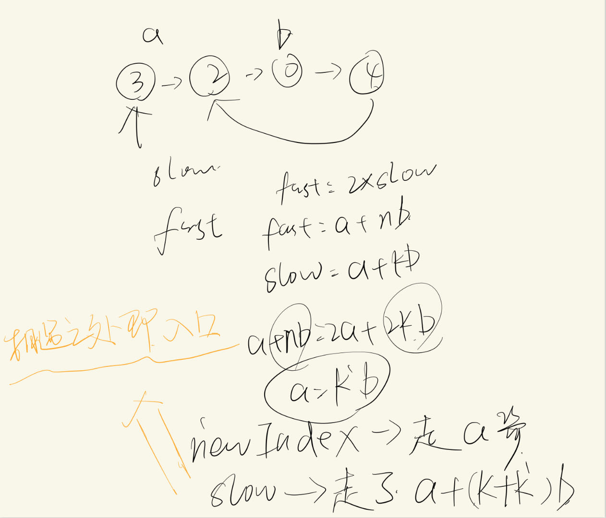

#  142.环形链表II

给定一个链表的头节点  `head` ，返回链表开始入环的第一个节点。 *如果链表无环，则返回 `null`。*

如果链表中有某个节点，可以通过连续跟踪 `next` 指针再次到达，则链表中存在环。 为了表示给定链表中的环，评测系统内部使用整数 `pos` 来表示链表尾连接到链表中的位置（**索引从 0 开始**）。如果 `pos` 是 `-1`，则在该链表中没有环。**注意：`pos` 不作为参数进行传递**，仅仅是为了标识链表的实际情况。

**不允许修改** 链表。

 

**示例 1：**


```
输入：head = [3,2,0,-4], pos = 1
输出：返回索引为 1 的链表节点
解释：链表中有一个环，其尾部连接到第二个节点。
```

**示例 2：**


```
输入：head = [1,2], pos = 0
输出：返回索引为 0 的链表节点
解释：链表中有一个环，其尾部连接到第一个节点。
```

**示例 3：**


```
输入：head = [1], pos = -1
输出：返回 null
解释：链表中没有环。
```

## 解题思路:

通过快慢指针形成路程差，再利用第三个指针最终可以使得两指针在环链入口处相遇。



## 代码：

```java
public class Solution {
    public ListNode detectCycle(ListNode head) {
        ListNode fast=head;
        ListNode slow=head;
        while(true){
            if (fast == null || fast.next == null) return null;
            fast=fast.next.next;
            slow=slow.next;
            if(fast==slow) break;
        }
        //设链表共有 a+b 个节点
        //fast=2*slow
        //fast=slow+nb
        //得到slow=nb,让slow再走a
        //同时把cur=head开始走然后slow和cur在a位置相遇
        ListNode cur=head;
        while(cur!=slow){
            cur=cur.next;
            slow=slow.next;
        }
        return cur;
    }
}
```


